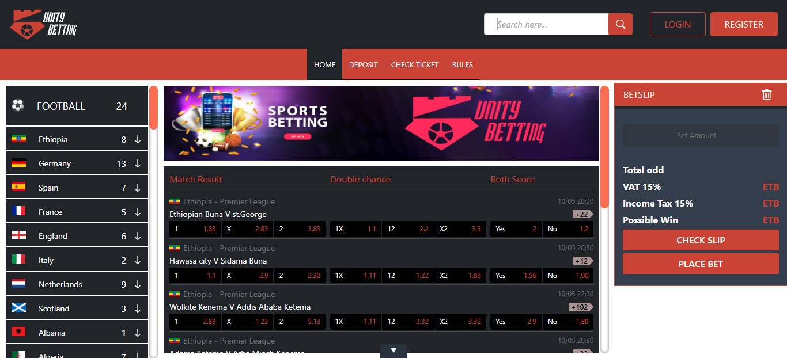
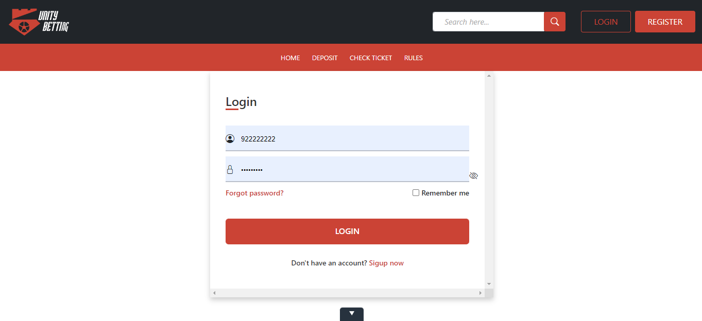

<h1>Sports-betting-web-app</h1>

This simple web app build by HTML,CSS,javascript,jquery,Bootstrap and procedural php. 
In this web app:  
      user can Register and login, 
      user can send balance to another user, 
      only registerd user can bet and see their bet histories. 

<h1>Basic requirements</h1>
<ul>
<li>XAMP or WAMP</li>
<li>Chrome, Edge or Safari browsers</li>
<li>Database Server</li>
</ul>

<h1>To successfully utilize this sporting betting application</h1>
<ul>
<li>Create a Database called "Unitybet" using any of the above Dev Server. </li>
<li>Import unitybet.sql to this database, located in db folder </li>
<li>Go to your browser and run this URL http://localhost/Sports-betting-web-app/. </li>
<li>Create an account using this URl http://localhost/Sports-betting-web-app/Register.php </li>

</ul>
